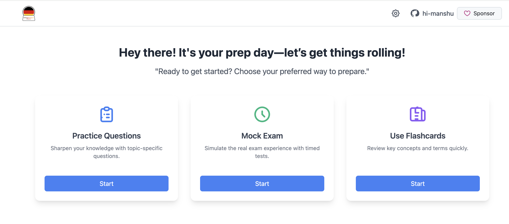

# Einbürgerungstest Practice Application

🌐 [Visit the live app: einburgerungstest-practice.de](https://www.einburgerungstest-practice.de)

## Einbürgerungstest – German Naturalization Test

The **Einbürgerungstest** is the official German naturalization (citizenship) test. It consists of **33 multiple-choice questions** covering essential topics such as German history, politics, society, and values. To pass, you must correctly answer **at least 17 questions** within the allotted time.

---

## Why This Project Is Useful

- **Prepare for German Citizenship:** Practice and familiarize yourself with the actual test format to confidently approach the exam.
- **Learn About Germany:** Gain insights into Germany’s culture, laws, and democratic system—even if you are not applying for citizenship.
- **Improve German Language Skills:** The test is conducted in German, making this a great tool to enhance your language comprehension through practical application.

---

## 🚀 Features

- **Practice Mode:** Answer general or state-specific questions with instant feedback.
- **Exam Mode:** Timed 33-question simulation including state questions.
- **Flashcard Mode:** Quick review of questions and answers.
- **State Selection:** Focus practice on a chosen German federal state.
- **Multilingual Support:** View questions in multiple languages (Exam mode is German only).

---

## 🚩 Getting Started: Firebase Setup

To run this project locally, you need to add your Firebase configuration file:

1. Create a file named `firebase.ts` in the following directory of the project:  
   `src/analytics/`

2. Add the following Firebase configuration structure inside `firebase.ts` with dummy values:

```typescript
const firebaseConfig = {
  apiKey: "YOUR_API_KEY_HERE",
  authDomain: "YOUR_PROJECT_ID.firebaseapp.com",
  projectId: "YOUR_PROJECT_ID",
  storageBucket: "YOUR_PROJECT_ID.appspot.com",
  messagingSenderId: "YOUR_MESSAGING_SENDER_ID",
  appId: "YOUR_APP_ID",
  measurementId: "YOUR_MEASUREMENT_ID",
};
```

For detailed instructions and more information, visit the official Firebase documentation: https://firebase.google.com/

> If you like this project, please give it a ⭐ on GitHub!
